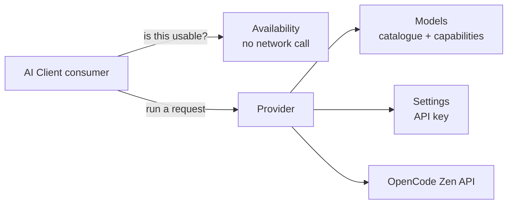

<div align="center">


# AI Provider for OpenCode Zen

[](https://wordpress.org/plugins/alamin-ai-provider-for-opencode-zen/)
[](https://wordpress.org/plugins/alamin-ai-provider-for-opencode-zen/)
[](https://wordpress.org/plugins/alamin-ai-provider-for-opencode-zen/)
[](https://wordpress.org/plugins/alamin-ai-provider-for-opencode-zen/advanced/)
[](LICENSE)

A OpenCode Zen provider for the WordPress AI Client — register the models, hand over an API key, and anything that already speaks AI Client can call them.

</div>

> [!NOTE]
> Not affiliated with OpenCode Zen. You supply your own API key, and requests are billed to your own account.

## Quick Start

Install from the WordPress admin — **Plugins → Add New**, search for "AI Provider for OpenCode Zen", then **Install Now** and **Activate**. Add your API key on the plugin's settings screen.

To run it from source instead:

```bash
git clone https://github.com/mralaminahamed/ai-provider-for-opencode-zen.git
cd alamin-ai-provider-for-opencode-zen
composer install
composer stubs:install
```

Needs the WordPress **AI Client** — this plugin implements its provider contract and does nothing on its own. Minimum WordPress, PHP, and tested-up-to versions are shown in the badges above; `readme.txt` and the plugin header are the source of truth.

## What It Does

The AI Client defines what a provider looks like; it does not ship every provider. This is the OpenCode Zen implementation — it declares the models, reports whether the site is configured to reach them, and performs the requests.

There is no interface of its own to learn. Install it and OpenCode Zen's models appear to whatever already speaks AI Client, which is the point: the calling code does not learn a new API, and does not learn this plugin's name.

## Features

| Feature | Description |
|---------|-------------|
| Model catalogue | OpenCode Zen models, with per-model capabilities declared to the AI Client |
| Cheap availability | Whether the provider is usable is answered without a network call |
| Key storage | Stored server-side under `connectors_ai_opencode_zen_api_key`; never sent to the browser |
| Provider metadata | What the AI Client displays and reasons about |
| Static analysis | PHPStan at level max |

## Development

```bash
composer install             # Dependencies + dev tooling
composer stubs:install       # WordPress and AI Client stubs, for static analysis

composer test                # PHPUnit (98 tests)
composer test-f -- --filter SomeTest
composer phpcs               # WordPress coding standards lint
composer phpcbf              # Auto-fix coding standards
composer phpstan             # Static analysis (level max)
composer analyze             # phpcs + phpstan
composer lint:review         # Stricter directory-review ruleset
composer makepot             # Translations
composer release             # Build and package
```

## Architecture



PHP lives under the PSR-4 namespace `OpenCodeZen\OpenCodeZenAiProvider\`:

```
alamin-ai-provider-for-opencode-zen.php
includes/
  Provider/                  AI Client provider implementation — the request entry point
  Models/                    Model identifiers and per-model capabilities
  Metadata/                  Provider metadata the AI Client displays
  Availability/              Whether the provider is usable right now
  Settings/                  API key storage and the settings screen
templates/                   Settings markup
tests/phpunit/               PHPUnit (98 tests)
```

The split worth knowing is **Availability against Provider**. Availability answers "can this be used" without making a network call, so a consumer can enumerate every installed provider cheaply and only reach the network when it actually intends to send a request.

## Security

- The API key is stored server-side and never reaches the browser, a log, an error message, or a REST response
- Requests go to OpenCode Zen only, with your key, billed to your account
- No analytics, telemetry, or phone-home

Report vulnerabilities privately — see the [security policy](SECURITY.md).

## Changelog

The complete version history lives in [CHANGELOG.md](CHANGELOG.md). [`readme.txt`](readme.txt) carries only the most recent releases, and is rendered on the [WordPress.org changelog page](https://wordpress.org/plugins/alamin-ai-provider-for-opencode-zen/#developers).

## Contributing

Bug reports, feature requests, and pull requests are welcome. Read the [contributing guide](CONTRIBUTING.md) before opening a pull request, and file issues on the [issue tracker](https://github.com/mralaminahamed/ai-provider-for-opencode-zen/issues).

## Maintainer

Al Amin Ahamed — [alaminahamed.com](https://alaminahamed.com) · [@mralaminahamed](https://github.com/mralaminahamed)

## License

[GPL-2.0-or-later](LICENSE)
